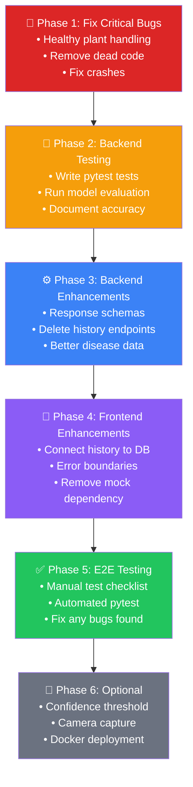

# PlantCare — Full Project Audit & Completion Plan

## Project Audit Summary

I've thoroughly audited every file in your project. Here's the current status:

### What's DONE ✅

| Component | Status | Files |
|-----------|--------|-------|
| **AI Model Training** | ✅ Complete | `train.py` — MobileNetV3-Large, 15 epochs, 38 classes |
| **Trained Model** | ✅ Saved | `models/best_model.pth` (17.2 MB) |
| **Class Names** | ✅ Generated | `class_names.json` (38 classes) |
| **Training Dataset** | ✅ Present | `datasset/train/` and `datasset/valid/` (38 folders each) |
| **Model Evaluation** | ✅ Complete | `evaluate.py` — classification report |
| **Backend Classifier** | ✅ Complete | `services/classifier.py` — loads model, predicts disease |
| **Predict API** | ✅ Complete | `POST /predict` — upload image → get diagnosis |
| **Diseases API** | ✅ Complete | `GET /diseases`, `GET /diseases/{slug}` |
| **History API** | ✅ Complete | `GET /history` |
| **Database Models** | ✅ Complete | `Disease`, `HistoryItem` tables (PostgreSQL) |
| **DB Seed Script** | ✅ Complete | `seed_diseases.py` — populates diseases from class names |
| **Frontend — Home** | ✅ Complete | Landing page with hero, how-it-works, sample result |
| **Frontend — Scan** | ✅ Complete | Image upload with drag-drop, tips, analyze button |
| **Frontend — Result** | ✅ Complete | Disease detail with confidence bar, severity, recommendations |
| **Frontend — Diseases** | ✅ Complete | Disease library with search & crop filter |
| **Frontend — Disease Detail** | ✅ Complete | Individual disease page with treatment guide |
| **Frontend — History** | ✅ Complete | Scan history list with delete & clear |
| **UI Components** | ✅ Complete | 20+ components (Button, Card, Badge, Accordion, etc.) |
| **Layout (Nav/Footer)** | ✅ Complete | Navbar, Footer, BottomTabBar, MobileNav |
| **Loading Skeletons** | ✅ Complete | ResultSkeleton, DiseaseCardSkeleton, HistoryItemSkeleton |

### What's BROKEN or MISSING ❌

| Issue | Severity | Details |
|-------|----------|---------|
| **`diseases.json` is EMPTY** | 🔴 Critical | `app/data/diseases.json` is blank — `disease_data.py` will crash on import since it tries to `json.loads("")` |
| **Dead code: `disease_data.py` & `history_store.py`** | 🟡 Medium | These old JSON-file-based services are unused — routers now use PostgreSQL directly. But `disease_data.py` crashes at import because `diseases.json` is empty |
| **Dead code: `inference.py`** | 🟡 Medium | Old sklearn-based inference file (uses joblib/RandomForest). Not used — replaced by `classifier.py` which uses PyTorch |
| **No backend tests** | 🔴 Critical | Zero test files. `pytest` and `httpx` are in `requirements.txt` but no tests written |
| **No frontend tests** | 🟡 Medium | No test framework or test files |
| **No "healthy plant" handling** | 🔴 Critical | If the model predicts a "healthy" class (e.g., `tomato-healthy`), the slug won't match any disease in DB → API returns 500 error |
| **History delete is client-only** | 🟡 Medium | History page deletes from `localStorage` only, not from PostgreSQL |
| **No DELETE `/history` endpoint** | 🟡 Medium | Backend has no endpoint to delete history items |
| **No input validation schemas** | 🟡 Medium | No Pydantic response schemas — raw SQLAlchemy objects serialized directly |
| **No error boundary on frontend** | 🟡 Medium | No global error handling if backend is down |
| **No Docker/deployment config** | 🟡 Low | No Dockerfile, docker-compose, or deployment scripts |
| **Model accuracy unknown** | 🟡 Medium | `evaluate.py` exists but results aren't documented anywhere |

---

## Proposed Implementation Plan

### Phase 1: Fix Critical Bugs (Must Do First)

> [!CAUTION]
> These bugs will cause runtime crashes. Fix before any testing.

#### 1.1 Handle "Healthy Plant" Predictions

**Problem**: Model has 10 healthy classes (e.g., `Tomato___healthy`). When predicted, the slug `tomato-healthy` won't exist in the diseases table → **500 error**.

**Fix in** [predict.py](file:///d:/clone/pyqt/PlantCare/backend/app/routers/predict.py):
- Before DB lookup, check if the predicted slug contains "healthy"
- If healthy: return a special success response (no disease found, plant is healthy)
- Save to history with `diseaseName = "Healthy"` and `severity = "none"`

#### 1.2 Fix or Remove Dead Code

**Files to clean up:**
- [disease_data.py](file:///d:/clone/pyqt/PlantCare/backend/app/services/disease_data.py) — crashes because `diseases.json` is empty. **Delete** (replaced by PostgreSQL queries in routers)
- [history_store.py](file:///d:/clone/pyqt/PlantCare/backend/app/services/history_store.py) — old JSON file store. **Delete** (replaced by PostgreSQL)
- [inference.py](file:///d:/clone/pyqt/PlantCare/backend/ai_model/inference.py) — old sklearn inference. **Delete** (replaced by `classifier.py`)
- Either delete `diseases.json` or populate it with valid data

#### 1.3 Fix Frontend for Healthy Results

Update the result page to handle a "healthy" response gracefully:
- Show a positive "Your plant is healthy! ✅" message
- No treatment/causes sections when healthy

---

### Phase 2: Backend Testing

> [!IMPORTANT]
> You have `pytest` and `httpx` already in `requirements.txt` — just need to write the tests.

#### 2.1 Unit Tests

Create `backend/tests/` directory with:

| Test File | What It Tests |
|-----------|---------------|
| `test_classifier.py` | Model loads correctly, prediction returns valid slug + confidence |
| `test_predict_endpoint.py` | `POST /predict` with a real test image → correct response shape |
| `test_predict_healthy.py` | `POST /predict` with healthy plant → returns healthy response (not 500) |
| `test_diseases_endpoint.py` | `GET /diseases` returns list, `GET /diseases/{slug}` returns detail |
| `test_history_endpoint.py` | `GET /history` returns list, history saved after prediction |
| `test_validation.py` | Invalid file type, empty file, oversized file → proper 400 errors |

#### 2.2 AI Model Evaluation

- Run `evaluate.py` and document the accuracy results
- Save the classification report to a file for reference
- Identify weakest classes (lowest precision/recall)

---

### Phase 3: Backend Enhancements

#### 3.1 Add Pydantic Response Schemas

Create `backend/app/schemas/` with proper response models:
- `PredictionResponse` — structured response for `/predict`
- `HealthyResponse` — response when plant is healthy
- `DiseaseResponse` — response for `/diseases/{slug}`
- `HistoryItemResponse` — response for `/history`

#### 3.2 Add Missing API Endpoints

| Endpoint | Method | Purpose |
|----------|--------|---------|
| `/history/{id}` | DELETE | Delete a single history item |
| `/history` | DELETE | Clear all history |
| `/predict/healthy-check` | - | Part of predict flow, not separate endpoint |

#### 3.3 Improve Disease Seed Data

The current `seed_diseases.py` generates **generic placeholder text** for all diseases. Enhance with:
- Disease-specific descriptions (not "is a plant disease affecting X crops")
- Specific chemical treatments per disease
- Specific prevention strategies per disease
- Add image URLs for each disease (for the disease library page)

---

### Phase 4: Frontend Enhancements

#### 4.1 Connect History to Backend Properly

- History page currently falls back to `localStorage` — make PostgreSQL the source of truth
- Add delete API calls when user deletes history items
- Add "Clear All" API call

#### 4.2 Add Error Boundary & Offline Handling

- Global error boundary component
- Show user-friendly message when backend is down
- Retry logic on API failures

#### 4.3 Remove Mock Data Dependency

- Home page currently imports `mockDiseases` for the sample preview
- Either keep mock data for the homepage demo OR fetch a real disease from the API

---

### Phase 5: Testing & Quality Assurance

#### 5.1 End-to-End Test Checklist

```
Manual Testing Checklist:
─────────────────────────
[ ] 1. Start PostgreSQL database
[ ] 2. Run seed script: python -m app.seed_diseases
[ ] 3. Start backend: uvicorn app.main:app --reload
[ ] 4. Start frontend: npm run dev
[ ] 5. Open http://localhost:3000 — home page loads
[ ] 6. Click "Scan Your Plant" — scan page loads
[ ] 7. Upload a diseased leaf image → get correct diagnosis
[ ] 8. Upload a healthy leaf image → get "healthy" response
[ ] 9. Check result page shows confidence, severity, treatments
[ ] 10. Go to History → see the scan you just made
[ ] 11. Delete a history item → removed from list
[ ] 12. Go to Disease Library → all diseases listed
[ ] 13. Search/filter diseases → works correctly
[ ] 14. Click a disease → detail page loads with treatments
[ ] 15. Test with invalid file (PDF) → proper error message
[ ] 16. Test with large file (>10MB) → proper error message
```

#### 5.2 Run Automated Tests

```bash
cd backend
pytest tests/ -v --tb=short
```

---

### Phase 6: Optional Enhancements (For Extra Credit)

| Enhancement | Description |
|-------------|-------------|
| **Model Confidence Threshold** | If confidence < 60%, show "Uncertain — please retake photo" warning |
| **Multiple Disease Detection** | Show top-3 predictions with confidence for each |
| **Camera Capture** | Add real-time camera capture (not just upload) on mobile |
| **User Authentication** | Add user accounts so history is per-user |
| **PDF Report Export** | Generate downloadable PDF of diagnosis + treatment plan |
| **Weather Integration** | Show weather-based disease risk warnings |
| **Docker Compose** | One-command setup: `docker-compose up` for backend + DB + frontend |
| **Model Retraining Pipeline** | Script to retrain with new images and auto-deploy |

---

## Recommended Execution Order



## Open Questions

> [!IMPORTANT]
> **Q1**: Do you want me to start with Phase 1 (fix critical bugs) right away?

> [!IMPORTANT]  
> **Q2**: For disease seed data (Phase 3.3) — do you want me to write detailed, disease-specific descriptions for all 26 diseases, or keep the auto-generated generic text?

> [!IMPORTANT]
> **Q3**: Do you want Docker deployment setup included, or are you running everything locally for now?

> [!IMPORTANT]
> **Q4**: Is this project for a university assignment/submission? That would help me prioritize what to focus on (e.g., testing documentation, code quality, report-ready outputs).
