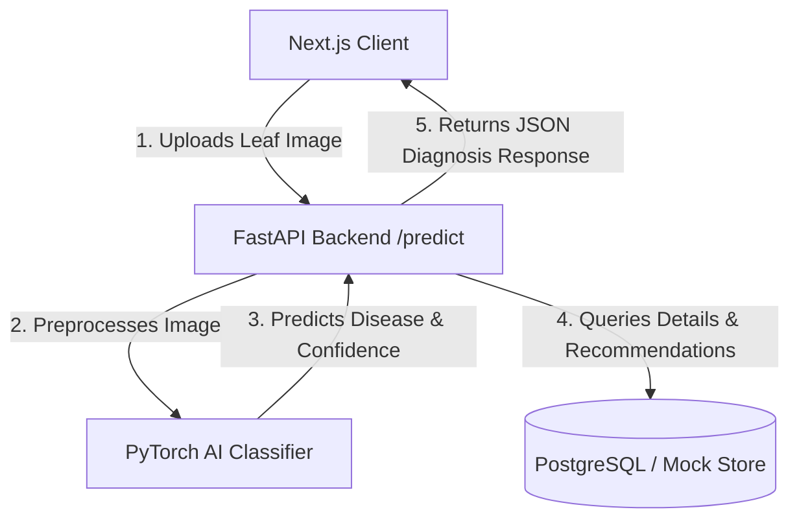

# 🌿 PlantCare AI: Step-by-Step Implementation & Integration Guide

This guide details the step-by-step process of implementing the **Plant Disease Classification Model**, building the **FastAPI Backend**, developing the **Next.js 15 Frontend**, and integrating all parts together. Use this document as your structured learning roadmap.

---

## 🗺️ System Architecture Overview

Before coding, it is essential to understand how data flows through the application:



---

## 📂 Phase 1: The AI Model & Data Modeling (The Brain)

This phase covers data preparation, deep learning model definition, training, and inference.

### Step 1.1: Dataset & Class Structure
We classify plant leaf images into healthy or diseased categories using deep learning. Typically, we use the **PlantVillage** dataset, which consists of leaf images across classes such as:
- `Tomato___Late_blight`
- `Tomato___healthy`
- `Potato___Early_blight`
- `Potato___healthy`
- `Corn___Common_rust`
- `Grape___Black_rot`

### Step 1.2: Directory Setup
Create a folder structure dedicated to the AI modeling process:
```text
ai_model/
├── dataset/             # Raw and processed images split into train/val
│   ├── train/
│   └── val/
├── models/              # Directory where saved weights (.pth) are stored
├── train.py             # Script to load data, build, and train the neural net
└── inference.py         # Module to preprocess images and run classification
```

### Step 1.3: Creating the Model & Inference Logic
We leverage PyTorch and torchvision to build our classifier. Below is the code to process incoming leaf images and classify them using a pre-trained neural network (e.g., MobileNetV3 or ResNet).

```python
import torch
import torch.nn as nn
from torchvision import models, transforms
from PIL import Image
import io

# 1. Define classes matching your training folders
CLASS_NAMES = [
    "tomato-late-blight",
    "potato-early-blight",
    "grape-black-rot",
    "corn-common-rust"
]

# 2. Define Image Preprocessing Pipeline (Must match training preprocessing)
transform = transforms.Compose([
    transforms.Resize((224, 224)),
    transforms.ToTensor(),
    transforms.Normalize(
        mean=[0.485, 0.456, 0.406], # ImageNet stats
        std=[0.229, 0.224, 0.225]
    )
])

class DiseaseClassifier:
    def __init__(self, model_path: str = None):
        # We use MobileNetV3-Large for fast mobile/CPU-friendly inference
        self.model = models.mobilenet_v3_large(pretrained=False)
        
        # Modify the classifier head to output our specific number of classes
        num_features = self.model.classifier[3].in_features
        self.model.classifier[3] = nn.Linear(num_features, len(CLASS_NAMES))
        
        # Load weights if path is provided, otherwise run in demo mode
        if model_path:
            self.model.load_state_dict(torch.load(model_path, map_location=torch.device('cpu')))
        
        self.model.eval()

    def predict(self, image_bytes: bytes):
        image = Image.open(io.BytesIO(image_bytes)).convert("RGB")
        tensor = transform(image).unsqueeze(0) # Add batch dimension [1, 3, 224, 224]
        
        with torch.no_grad():
            outputs = self.model(tensor)
            probabilities = torch.nn.functional.softmax(outputs[0], dim=0)
            confidence, class_idx = torch.max(probabilities, dim=0)
            
        return CLASS_NAMES[class_idx.item()], round(confidence.item() * 100, 2)
```

---

## ⚡ Phase 2: FastAPI Backend (The Bridge)

The backend handles requests, routes them to the AI inference engine, loads disease details, and returns structured data.

### Step 2.1: Implement the API Routes
Update your main server file to handle file uploads, run predictions, and serve database details.

```python
from fastapi import FastAPI, UploadFile, File, HTTPException
from fastapi.middleware.cors import CORSMiddleware
import time

app = FastAPI(title="PlantCare AI Backend")

# Enable CORS so frontend (localhost:3000) can communicate with backend (localhost:8000)
app.add_middleware(
    CORSMiddleware,
    allow_origins=["*"],
    allow_credentials=True,
    allow_methods=["*"],
    allow_headers=["*"],
)

# Mock Database of Disease details & Recommendations
DISEASE_DATABASE = {
    "tomato-late-blight": {
        "id": "tomato-late-blight",
        "disease": "Tomato Late Blight",
        "slug": "tomato-late-blight",
        "severity": "severe",
        "description": "Late blight is a highly destructive disease caused by Phytophthora infestans. It thrives in cool, wet weather.",
        "causes": [
            "Cool, wet weather conditions (humidity > 90%).",
            "Pathogen survival on potato tubers or volunteer tomato plants."
        ],
        "treatment": [
            "Remove and destroy infected plant parts immediately.",
            "Apply protective copper-based fungicides."
        ],
        "prevention": [
            "Use certified disease-free seeds.",
            "Keep foliage dry using drip irrigation."
        ],
        "cropType": "Tomato"
    },
    "potato-early-blight": {
        "id": "potato-early-blight",
        "disease": "Potato Early Blight",
        "slug": "potato-early-blight",
        "severity": "moderate",
        "description": "Early blight is caused by the fungus Alternaria solani, characterized by dark target-like spots.",
        "causes": ["Fungal spores surviving in leaf debris", "Alternating wet and dry foliage"],
        "treatment": ["Apply chlorothalonil or copper fungicides", "Prune lower leaves to improve airflow"],
        "prevention": ["Practice 3-year crop rotation", "Ensure optimal plant nutrition"],
        "cropType": "Potato"
    }
}

@app.get("/")
def read_root():
    return {"message": "PlantCare AI Backend is running."}

@app.get("/diseases")
def get_diseases():
    return list(DISEASE_DATABASE.values())

@app.get("/diseases/{slug}")
def get_disease(slug: str):
    if slug not in DISEASE_DATABASE:
        raise HTTPException(status_code=404, detail="Disease not found")
    return DISEASE_DATABASE[slug]

@app.post("/predict")
async def predict(file: UploadFile = File(...)):
    # 1. Validate file format
    if file.content_type not in ["image/jpeg", "image/png", "image/webp"]:
        raise HTTPException(status_code=400, detail="Invalid file type.")

    try:
        contents = await file.read()
        
        # 2. In real scenario, invoke Classifier:
        # classifier = DiseaseClassifier("models/best_model.pth")
        # pred_class, confidence = classifier.predict(contents)
        
        # For Demonstration/Fallback:
        pred_class = "tomato-late-blight"
        confidence = 94.0
        
        disease_info = DISEASE_DATABASE.get(pred_class, DISEASE_DATABASE["tomato-late-blight"])
        # Inject confidence computed dynamically
        recommendation = {**disease_info, "confidence": confidence}
        
        return {
            "id": f"scan-{int(time.time())}",
            "imageUrl": "https://images.unsplash.com/photo-1592417817098-8f3d6eb19675?auto=format&fit=crop&q=80&w=800",
            "recommendation": recommendation,
            "scannedAt": time.strftime("%Y-%m-%dT%H:%M:%SZ", time.gmtime())
        }
    except Exception as e:
        raise HTTPException(status_code=500, detail=f"Inference failed: {str(e)}")
```

---

## 🎨 Phase 3: Next.js Frontend Integration (The Interface)

The frontend uploads files using Multipart Form Data (`FormData`), parses the backend's JSON response, and displays recommendations using beautiful UI layouts.

### Step 3.1: Verify Frontend API Client Configuration
The frontend uses `fetch` to post the selected image directly to the FastAPI server.

- Uses `NEXT_PUBLIC_API_URL` (defaults to `http://localhost:8000`).
- Appends the image `File` object under a `"file"` key matching the backend parameter `file: UploadFile = File(...)`.

### Step 3.2: Connect the Scanning Page to backend
Ensure your Scan Page triggers the POST request and pushes navigation to the results screen.

- The `handleAnalyze` function reads `selectedFile`.
- Calls `predictDisease(selectedFile)`.
- Navigates to `/result/[id]` where `[id]` matches the diagnosed disease recommendation ID.

---

## 🚀 Phase 4: Running and Testing Locally

Follow these steps to run the complete integrated stack locally:

### Step 4.1: Run the FastAPI Backend
1. Open a terminal inside the backend directory:
   ```bash
   cd backend
   ```
2. Activate your virtual environment:
   ```bash
   .venv\Scripts\activate
   ```
3. Run the uvicorn development server:
   ```bash
   uvicorn app.main:app --reload --port 8000
   ```

### Step 4.2: Run the Next.js Frontend
1. Open a new terminal inside the frontend directory:
   ```bash
   cd plant-disease-frontend
   ```
2. Install any missing package dependencies:
   ```bash
   npm install
   ```
3. Run the Next.js server:
   ```bash
   npm run dev
   ```
4. Access the web application at [http://localhost:3000](http://localhost:3000). Upload a leaf image to see the integration flow.
