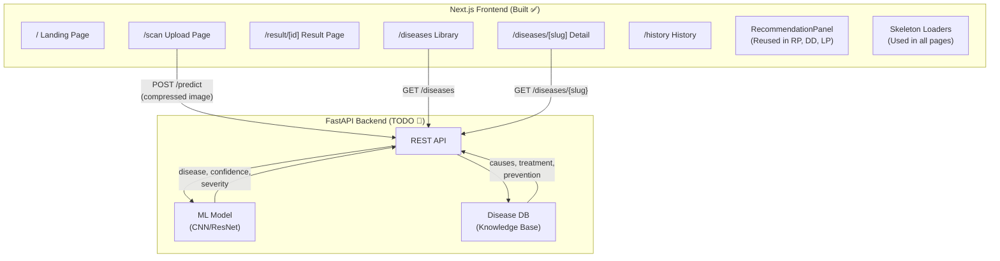

# PlantCare AI — Full Project Summary

## What Is This Project?

A **Next.js 16 + TypeScript + Tailwind CSS v4 + shadcn/ui (base-nova)** frontend for a **plant disease detection and treatment recommendation system**. Users upload a photo of a diseased crop leaf → the AI diagnoses the disease → the app displays actionable treatment, prevention, and cause information.

---

## Tech Stack

| Layer | Technology |
|---|---|
| Framework | Next.js 16 (App Router, Turbopack) |
| Language | TypeScript |
| Styling | Tailwind CSS v4 |
| UI Components | shadcn/ui (base-nova style, uses `@base-ui/react`) |
| Icons | Lucide React |
| Image Upload | react-dropzone + browser-image-compression |
| Data Fetching | SWR (installed, ready for API integration) |
| Font | Inter (Google Fonts) |

---

## What Has Been Built ✅

### File Tree

```
plant-disease-frontend/
├── next.config.ts                    ← Unsplash image domain whitelisted
├── package.json
├── components.json                   ← shadcn config (base-nova style)
├── src/
│   ├── app/
│   │   ├── layout.tsx                ← Root layout: Navbar + Footer + BottomTabBar
│   │   ├── globals.css               ← Global styles, Inter font
│   │   ├── page.tsx                  ← Landing page (Hero, How It Works, Sample Result)
│   │   ├── scan/
│   │   │   └── page.tsx              ← Upload flow with drag-drop + camera
│   │   ├── result/
│   │   │   └── [id]/
│   │   │       └── page.tsx          ← Diagnosis result + recommendations
│   │   ├── diseases/
│   │   │   ├── page.tsx              ← Searchable disease library grid
│   │   │   └── [slug]/
│   │   │       └── page.tsx          ← Individual disease detail + recommendations
│   │   └── history/
│   │       └── page.tsx              ← Past scans from localStorage
│   ├── components/
│   │   ├── layout/
│   │   │   ├── Navbar.tsx            ← Sticky top nav, desktop links
│   │   │   ├── MobileNav.tsx         ← Sheet drawer for mobile
│   │   │   ├── Footer.tsx            ← 4-column responsive footer
│   │   │   └── BottomTabBar.tsx      ← Mobile-only fixed bottom tabs
│   │   ├── result/
│   │   │   ├── ConfidenceBar.tsx     ← Color-coded animated confidence bar
│   │   │   ├── SeverityBadge.tsx     ← Low/Moderate/Severe badge
│   │   │   └── RecommendationPanel.tsx ← CORE: Accordion with treatment steps
│   │   ├── scan/
│   │   │   └── ImageUploader.tsx     ← Drag-drop + camera + compression
│   │   ├── shared/
│   │   │   ├── DiseaseCard.tsx       ← Card for library grid
│   │   │   ├── EmptyState.tsx        ← "No results" placeholder
│   │   │   ├── ErrorMessage.tsx      ← Error display with retry button
│   │   │   └── MediaSkeleton.tsx     ← Reusable image skeleton
│   │   ├── skeletons/
│   │   │   ├── DiseaseCardSkeleton.tsx
│   │   │   ├── ResultSkeleton.tsx
│   │   │   └── HistoryItemSkeleton.tsx
│   │   └── ui/                       ← shadcn auto-generated
│   │       ├── accordion.tsx
│   │       ├── badge.tsx
│   │       ├── button.tsx
│   │       ├── card.tsx
│   │       ├── input.tsx
│   │       ├── sheet.tsx
│   │       ├── skeleton.tsx
│   │       └── tabs.tsx
│   └── lib/
│       ├── types.ts                  ← Shared TypeScript interfaces
│       ├── mock-data.ts              ← 4 realistic disease records
│       ├── api.ts                    ← Typed fetch functions for FastAPI
│       └── utils.ts                  ← cn() helper (clsx + tailwind-merge)
```

### Pages Built (6 routes)

| Route | Page | Status |
|---|---|---|
| `/` | Landing page with hero, "how it works", live sample result preview, disease chips | ✅ Complete |
| `/scan` | Image upload with drag-drop, camera, gallery, compression, scan tips | ✅ Complete |
| `/result/[id]` | Diagnosis result with confidence bar, severity badge, recommendation panel, save/share | ✅ Complete |
| `/diseases` | Searchable/filterable disease library grid with skeleton loading | ✅ Complete |
| `/diseases/[slug]` | Individual disease detail reusing RecommendationPanel | ✅ Complete |
| `/history` | Past scans list from localStorage with delete/clear | ✅ Complete |

### Core Features Built

- **RecommendationPanel** — The central reusable component. Accordion with 4 sections: Description, Causes, Treatment (numbered steps), Prevention (bullet list). Shows low-confidence warning when < 60%.
- **Skeleton loading everywhere** — Zero spinners in the entire project. Every loading state uses shadcn's `Skeleton` component.
- **Client-side image compression** — Images compressed to ≤ 1MB and ≤ 1024px before upload.
- **Responsive layout** — Mobile-first with bottom tab bar, stacked layouts on mobile, multi-column on desktop.
- **localStorage history** — Scan results saved locally and displayed on the History page.

---

## What Still Needs Development 🔧

### 1. FastAPI Backend (Not Started)

The frontend expects these API endpoints:

| Method | Endpoint | Request | Response |
|---|---|---|---|
| `POST` | `/predict` | `multipart/form-data` with `file` field | `ScanResult` object |
| `GET` | `/diseases` | — | `DiseaseRecommendation[]` |
| `GET` | `/diseases/{slug}` | — | `DiseaseRecommendation` |
| `GET` | `/history` | — | `HistoryItem[]` |

> Currently all pages use **mock data** from `src/lib/mock-data.ts`. The `api.ts` file is written and typed but the backend doesn't exist yet. The scan page gracefully falls back to mock data when the API is unreachable.

**To build:**
- FastAPI server with a trained image classification model (CNN/ResNet/EfficientNet)
- `/predict` endpoint that accepts an image and returns disease name, confidence, severity, and recommendation data
- `/diseases` endpoints serving the disease knowledge base

### 2. Real ML Model Integration

- Train or import a plant disease classification model (e.g., using the PlantVillage dataset)
- The model should output: disease name, confidence score, and severity level
- The recommendation data (causes, treatment, prevention) can come from a database lookup keyed by disease name

### 3. Database for Disease Knowledge Base

Currently the 4 mock diseases are hardcoded. For production:
- Store disease records in a database (PostgreSQL, MongoDB, etc.)
- Include all supported diseases with their full recommendation data
- API endpoints should query this database

### 4. User Authentication (Optional)

- Currently history is localStorage-only (browser-local, no sync)
- Add auth (NextAuth.js, Clerk, etc.) if you want:
  - Cloud-synced scan history
  - User-specific dashboards
  - Saved favorite diseases

### 5. SWR Integration for Live Data

- `swr` package is installed but not yet wired into pages
- When the backend is ready, replace the `useState + setTimeout` mock fetching in each page with SWR hooks:
  ```tsx
  const { data, error, isLoading } = useSWR("/diseases", fetcher)
  ```

### 6. Production Polish

- [ ] Replace mock Unsplash images with real disease images from your dataset
- [ ] Add `next/image` `alt` text audit for accessibility
- [ ] Lighthouse performance audit (target ≥ 90)
- [ ] Color contrast check on severity badges (WCAG AA)
- [ ] Add proper error boundaries
- [ ] SEO meta tags per page (currently only root layout has them)
- [ ] Progressive Web App (PWA) support for offline field use

### 7. Testing

- [ ] Unit tests for utility functions
- [ ] Component tests for RecommendationPanel, ConfidenceBar, SeverityBadge
- [ ] E2E tests for the upload → result flow
- [ ] Responsive visual regression tests at 375px, 768px, 1024px, 1440px

---

## Architecture Diagram



---

## Quick Start

```bash
cd plant-disease-frontend
npm install
npm run dev
# Open http://localhost:3000
```

> The app runs fully with mock data — no backend needed for development/demo purposes.
